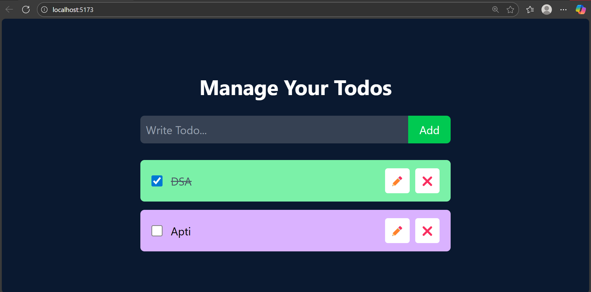

# 📝 To-Do App – React + TailwindCSS

A **To-Do List application** built using **React** and **TailwindCSS**. This app allows users to add, mark, and delete tasks with an elegant and responsive UI.

---

## 🚀 Features

- ✅ Add new tasks
- 📌 Mark tasks as completed
- ✏️ Edit tasks
- 🗑️ Delete tasks
- 🌙 Clean UI with TailwindCSS
- 💡 Built using React functional components and hooks

---

## 📸 Preview

 

---

## 🛠️ Technologies Used

- **React**: A JavaScript library for building user interfaces.
- **TailwindCSS**: A utility-first CSS framework for rapid UI development.
- **Vite**: A fast build tool for modern web development.
---

## ⚙️ Getting Started

### Prerequisites

- Node.js (v18.18.0 or later)
- npm

### Installation

1.  Clone the repository:
    ```bash
    git clone [https://github.com/prathamesonar/to-do-app.git](https://github.com/prathamesonar/to-do-app.git)
    ```
2.  Navigate to the project directory:
    ```bash
    cd to-do-app
    ```
3.  Install the dependencies:
    ```bash
    npm install
    ```

### Available Scripts

In the project directory, you can run:

-   `npm run dev`: Runs the app in the development mode.
---
